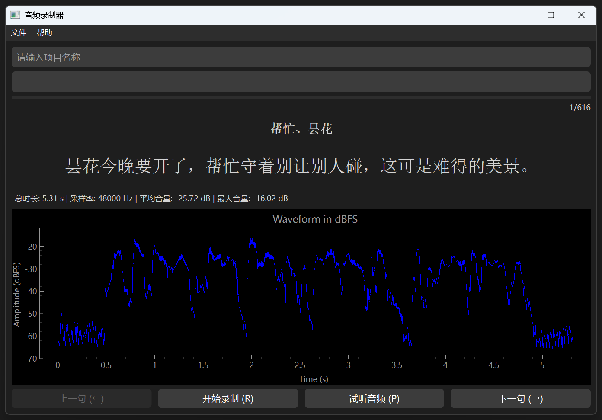

# 中文TTS迷你语料库

专为语音克隆项目（如[GPT-SoVITS](https://github.com/RVC-Boss/GPT-SoVITS)）设计的轻量级中文TTS语料工具包，包含精选文本集和音频录制工具，帮助快速构建定制化数据集。

## 项目特性

- 精选文本集：包含600+句子，涵盖各种发音、语调、情感、场景。
- 音频录制工具：可快速启动、快速录制、实时监测音频质量。


## 使用场景

- GPT-SoVITS等模型的微调数据准备
- 个性化语音合成数据采集
- 语音克隆算法快速验证

## 语料库数据统计

1. zh_corpus_v1.json
    - 句子数: 616
    - 总字符数: 21059
    - 不重复字符数: 2271
    - 总汉字数: 19286
    - 不重复汉字数: 2228
    - GBK汉字覆盖率: 10.18%
    - 中文数字覆盖率: 100.0%
    
## 音频录制要求

| 参数 | 要求 |
|---|---|
| 音频格式 | WAV |
| 采样率 | 48kHz |
| 比特率 | 16bit |
| 音量 | -9dB~-6dB |
| 底噪 | ＜-30dB |
| 底噪 | ＜-30dB |
| 总音频时长 | >30分钟 |
| 推荐总音频时长 | 1~2小时 |

## 快速开始

1. 克隆项目到本地：  
    ```
    git clone https://github.com/Karasukaigan/zh-tts-mini-corpus.git
    ```
2. 双击`0.安装依赖.cmd`自动创建虚拟环境并安装依赖。
3. 双击`1.启动音频录制工具.cmd`打开音频录制器。
4. 在页面顶部输入项目名称，然后开始录音。  
    - 左箭头（←）: 显示上一句待录音文本。
    - 右箭头（→）: 显示下一句待录音文本。
    - R 键 : 开始或停止录音操作。
    - P 键 : 播放当前句子对应的已录制音频文件。
5. 点击菜单栏里的`文件 -> 保存到项目目录`，这将使录制好的音频文件整理成其他语音克隆项目所需的目录结构。您可以在终端查看处理进度，全部处理好后文件会被放到`projects`目录。
6. 点击菜单栏里的`文件 -> 打开项目目录`，然后将对应项目里的文件复制到其他语音克隆项目里使用。  

## 贡献指南

欢迎通过以下方式参与：
1. 测试、优化语料库。
2. 优化音频录制器功能。
